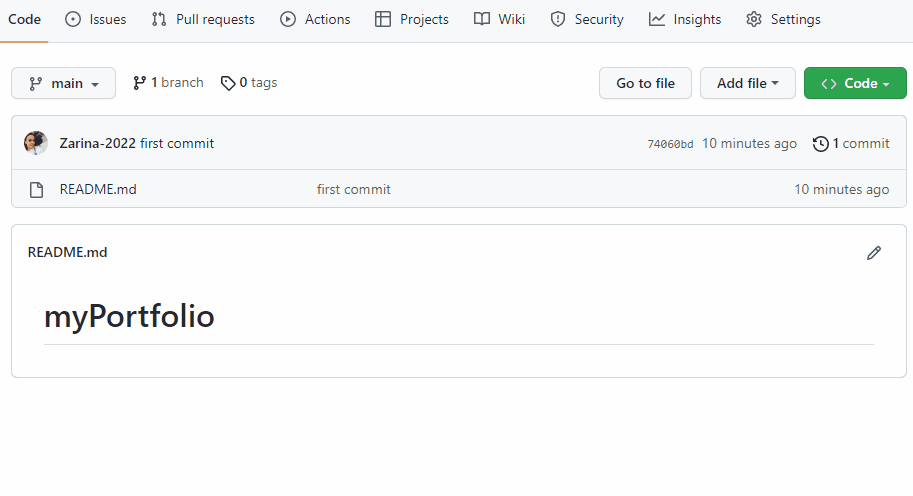

# myPortfolio

<h2> Here you can find a personal portfolio website designed step by step using HTML 
CSS and JavaScript.</h2>

<h2>This website design is completely responsive for all screen devices 
like mobile phones.</h2>

<h3>Additionally I used <a href="https://cdnjs.com/libraries/font-awesome"><b>Font Awesome</b> </a> (for icons) </h3>

<h3> I used JavaScript for <b>Open/Close menu</b> and for <b> Subtitels</b> </h3>

<h4>You can use this website to make your online resume or CV. </h4>

<h4>In this website I placed images, skills, work experience and education details .</h4>

<h4>There are also added the list of services and work portfolio.</h4>

<h4>In the footer of this website there are contact info and contact form. </h4>

<h3>Preview:</h3>

<h2> How to install and run the project. </h2>

Do share your valuable opinions, I appreciate your honest  

Enjoy Coding ❤

 

 
